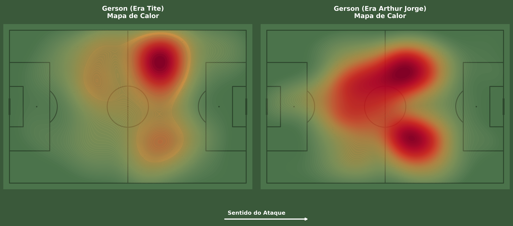
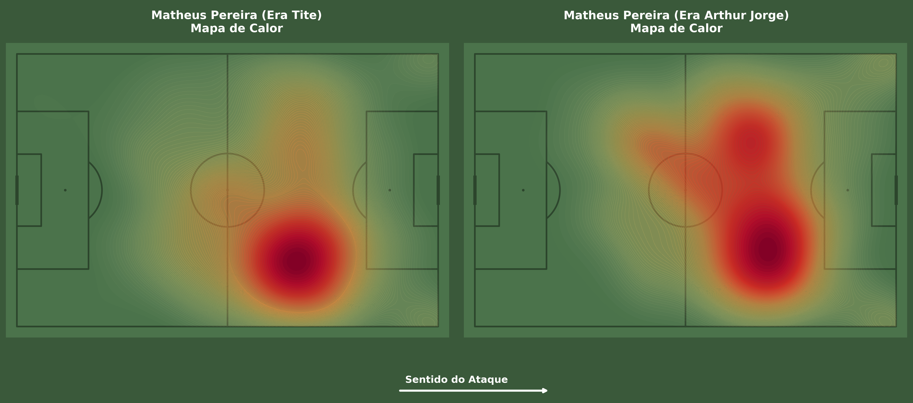
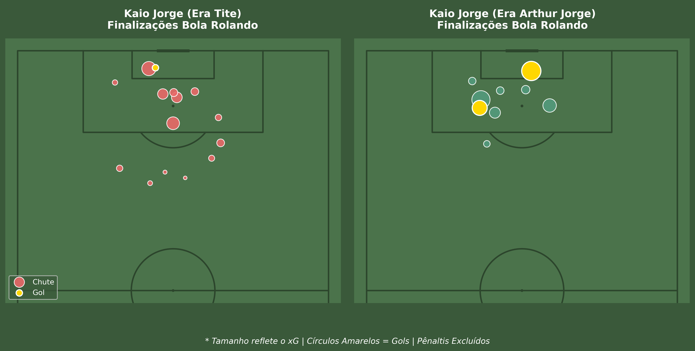
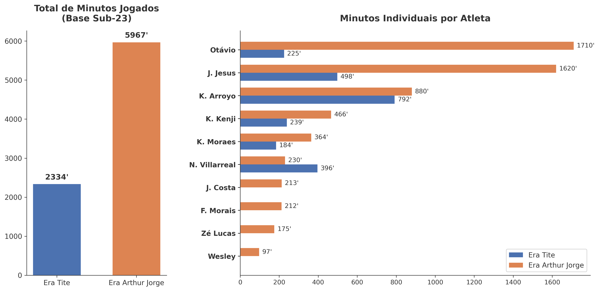

# Análise Tática e Estatística: Transição de Comando no Cruzeiro (Tite vs. Arthur Jorge)
Autor: Felipe Almeida Pereira

## Sobre o Projeto: O "Efeito Dominó"
Este projeto aplica técnicas de **Data Science** e **Futebol Analytics** para investigar as mudanças táticas práticas ocorridas no Cruzeiro após a troca de comando técnico (de Tite para Arthur Jorge). 

Ao invés de uma análise genérica, o foco principal do trabalho é rastrear um **"efeito dominó" tático**. Utilizando dados de eventos extraídos da plataforma Sofascore, mapeamos como o reposicionamento de um único atleta na base da jogada gerou um impacto em cadeia que alterou a criação, a letalidade do ataque e, por fim, a gestão de minutagem dos ativos do clube.

## Metodologia e Amostragem
Para garantir rigor analítico e evitar vieses, a amostra de dados foi estritamente controlada:
* **Análise Tática (Gerson, Matheus Pereira e Kaio Jorge):** Exatas 8 partidas de cada treinador (jogos recentes pelo Brasileirão e reta final do Campeonato Mineiro).
* **Gestão de Ativos (Base Sub-23):** Expandida para exatas 19 partidas de cada treinador, garantindo uma comparação absoluta de minutos distribuídos para o elenco como um todo.
* **Métricas Extraídas:** Mapas de Calor (KDE Plots), Mapas de Finalização (Shot Maps), xG (Expected Goals), xA (Expected Assists), Passes Progressivos e Ações por 90 minutos (p90).

---

## Principais Insights Visuais

### 1. O Início da Cadeia: A Liberdade de Gerson
A análise espacial comprova que Gerson deixou de atuar de forma "presa" na primeira linha defensiva e ganhou liberdade de flutuação. Com o novo comando, ele não apenas pisa mais no terço final, mas assumiu o papel de principal motor de passes progressivos e decisivos (*Key Passes*) da equipe.

  

### 2. O Desafogo e a Centralização de Matheus Pereira
Com Gerson assumindo a saída de bola, o mapa de Matheus Pereira sofreu uma alteração drástica. Ele deixa de buscar a bola nas laterais defensivas e passa a dominar a entrelinha central. O reflexo disso é a eficiência: tocando o mesmo número de vezes na bola por 90 minutos, seu **xA (Assistências Esperadas) saltou de 1.07 para 2.80**.

  

### 3. O Fim da Cadeia: Letalidade de Kaio Jorge
O resultado prático de uma bola que progride com qualidade e chega limpa na zona de criação central. O mapa de chutes ilustra como as finalizações de baixa probabilidade (fora da área) deram lugar a chutes na "Zona de Ouro". O **xG (Gols Esperados) do centroavante praticamente dobrou (1.94 para 3.37)** na mesma amostra de jogos.

  

### 4. Gestão de Elenco: A Valorização do Sub-23
Para além das quatro linhas, os dados revelam uma mudança na gestão do DNA do clube. No recorte pareado de 19 jogos, a minutagem concedida a atletas da base mais que dobrou, provando uma democratização de oportunidades no elenco principal.

  

---

