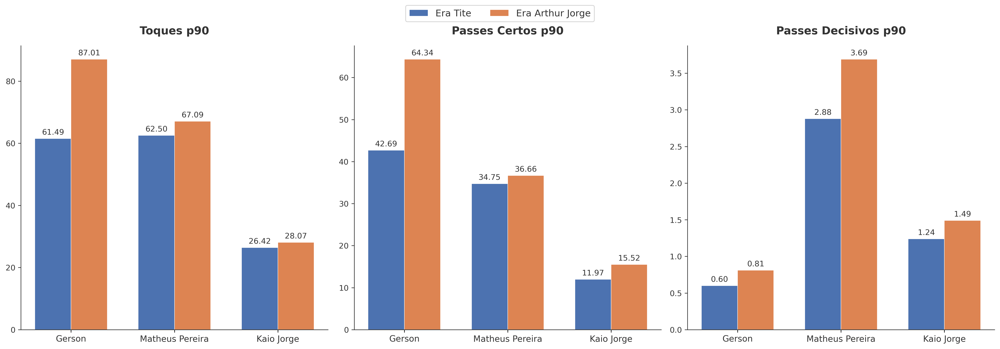

# Análise Tática e Estatística: Transição de Comando no Cruzeiro

**Tite vs. Arthur Jorge — um estudo de Football Analytics sobre mudanças de função, criação e finalização**

**Autor:** Felipe Almeida Pereira  
**Tecnologias:** Python · Pandas · Matplotlib · mplsoccer  
**Dados:** Sofascore  

## Sobre o projeto

Este projeto investiga como o Cruzeiro se comportou após a mudança de comando técnico de Tite para Arthur Jorge.

Em vez de comparar o time apenas por resultados ou médias gerais, a análise acompanha um possível **"efeito dominó"** dentro da estrutura ofensiva:

**Gerson → Matheus Pereira → Kaio Jorge**

A proposta é observar se mudanças na ocupação e participação de Gerson aparecem acompanhadas por alterações no posicionamento e na criação de Matheus Pereira e, posteriormente, na localização e qualidade das finalizações de Kaio Jorge.

No final, o estudo amplia o recorte para avaliar também a utilização de atletas Sub-23 no elenco principal.

> **Nota:** a análise descreve padrões observados nos recortes selecionados e os interpreta à luz da hipótese tática. Ela não busca estabelecer causalidade direta entre as mudanças.

## Metodologia

### Amostra

- **Análise tática:** 8 partidas de cada treinador, mantendo o mesmo recorte para Gerson, Matheus Pereira e Kaio Jorge.
- **Utilização da base:** 19 partidas de cada treinador.
- A amostra tática reúne os jogos mais recentes do Arthur Jorge no Brasileirão e um recorte correspondente da passagem de Tite, incluindo a reta final do Campeonato Mineiro.

### Métricas e visualizações

- Heatmaps e KDE plots para análise espacial;
- Shot maps com tamanho dos marcadores proporcional ao xG;
- Passes progressivos e key passes;
- Métricas normalizadas por 90 minutos (p90);
- xG (Expected Goals) e xA (Expected Assists);
- Minutos de atletas Sub-23 no elenco principal.

# Principais insights

## 1. Gerson — mudança na ocupação espacial

Os mapas indicam uma **maior dispersão espacial** das ações de Gerson no recorte de Arthur Jorge, com maior presença também em regiões centrais e mais avançadas do campo.

Esse padrão é consistente com uma função mais móvel na construção da equipe.

**Figura 1 —** Ocupação espacial de Gerson nos recortes de Tite e Arthur Jorge.

## 2. Matheus Pereira — maior presença na entrelinha

No mesmo recorte de 8 partidas, Matheus Pereira passa a ocupar regiões mais centrais e próximas da área adversária.

O volume de toques por 90 minutos permaneceu próximo (**62,50 → 67,09**), enquanto os passes decisivos por 90 minutos aumentaram de **2,88 para 3,69**.

O **xA acumulado** também passou de **1,07 para 2,80**, um aumento de aproximadamente **162%**.

**Figura 2 —** Ocupação espacial de Matheus Pereira nos recortes comparados.

## 3. Kaio Jorge — finalizações em zonas de maior valor

O mapa de finalizações mostra uma mudança na distribuição espacial dos chutes, com maior concentração em regiões centrais e próximas ao gol no recorte de Arthur Jorge.

No mesmo conjunto de 8 partidas, o **xG acumulado** de Kaio Jorge passou de **1,94 para 3,37 (+74%)**.

**Figura 3 —** Localização das finalizações de Kaio Jorge; tamanho do marcador proporcional ao xG da finalização.

## 4. Volume e criação — métricas por 90 minutos

A comparação por 90 minutos ajuda a separar aumento de participação de diferenças no tempo total em campo.

Entre os resultados observados, Gerson apresenta aumento de **61,49 para 87,01 toques p90**, enquanto Matheus Pereira mantém volume semelhante de ações e aumenta sua participação em passes decisivos.

**Figura 4 —** Comparação de métricas selecionadas por 90 minutos.

## 5. Utilização da base — Sub-23

Em uma amostra ampliada de **19 partidas por treinador**, a minutagem total concedida a atletas Sub-23 passou de:

**2.334 minutos → 5.967 minutos**

Isso representa um aumento de aproximadamente **156%** no volume de minutos no recorte analisado.

**Figura 5 —** Minutos concedidos a atletas Sub-23 em 19 partidas de cada treinador.

## Conclusão

Os dados mostram mudanças consistentes na estrutura ofensiva do Cruzeiro entre os dois recortes analisados: Gerson passa a ocupar uma área espacial mais ampla, Matheus Pereira aparece mais centralizado e com maior produção criativa, e Kaio Jorge concentra mais finalizações em zonas de maior valor.

Em paralelo, a utilização de atletas Sub-23 aumenta de forma expressiva na amostra ampliada de 19 jogos.

O conjunto desses resultados sustenta a narrativa do **"Efeito Dominó"** como uma hipótese interpretativa para a mudança observada no funcionamento da equipe.

## Limitações

- A análise utiliza amostras relativamente pequenas, especialmente no recorte tático de 8 partidas.
- Os recortes dos treinadores não são um experimento controlado e podem sofrer influência de adversários, contexto dos jogos, competição, escalações e outros fatores.
- Os resultados identificam associações e padrões espaciais/estatísticos; portanto, não permitem atribuir causalidade direta a uma única mudança tática.

